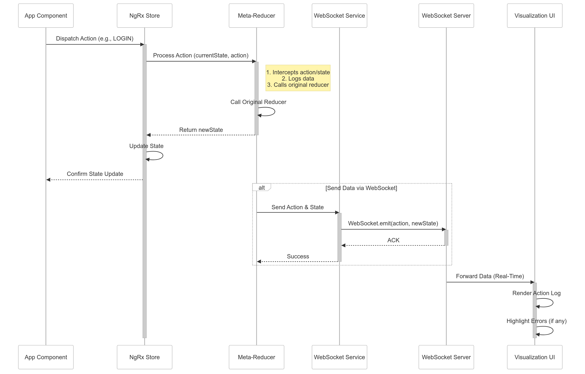

<div style="background-color: #ffcc00; color: #000; padding: 1em; border-radius: 5px; margin-bottom: 1em;">
  <strong>Alert:</strong> This project is currently under development.
</div>

# NgRx State Inspector 🛠️  
**State Management Observability for Angular Applications**  

---

## 📦 Core Architecture  



## 🚀 Quick Start  

### 1. Installation  
```bash
Coming Soon
```

---

## 🔍 Core Features  

### Real-Time Action Stream Monitoring  
```typescript
interface ActionTelemetry {
  sequenceId: number;
  type: string;
  trigger: 'USER' | 'API' | 'SYSTEM';
  timestamp: number;
  stateVersion: number;
  payloadSize: number;
  criticalPath: boolean;
}
```

### State Diff Engine  
Implements JSON Patch (RFC 6902) for efficient delta calculations:  
```json
{
  "ops": [
    {
      "op": "replace",
      "path": "/user/status",
      "value": "authenticated",
      "oldValue": "anonymous"
    }
  ],
  "version": 45,
  "checksum": "a1b2c3d4"
}
```

---

## 🧩 API Reference  

### WebSocket Protocol  
```typescript
interface StateUpdate<T> {
  action: string;
  correlationId: string;
  initiator: string;
  stateSnapshot: T;
  stateDelta: Operation[];
  sequenceChain: string[];
  error?: ErrorPayload;
}

interface ErrorPayload {
  code: number;
  message: string;
  stackTrace?: string;
  recoverySuggestion: string;
}
```

### Plugin System  
Create custom visualizers:  
```typescript
interface DevToolsPlugin {
  name: string;
  render: (ctx: PluginContext) => JSX.Element;
  onAction?: (action: Action) => void;
}

interface PluginContext {
  currentState: unknown;
  actionHistory: ActionTelemetry[];
  stateDiffs: StateDiff[];
}
```

---

## 🛠️ Advanced Configuration  

### State Hydration/Rehydration  
```typescript
StateInspectorModule.forRoot({
  stateHydration: {
    maxAge: 30, // Minutes
    storage: localStorage,
    key: '@app/state-history',
    serialize: (state) => LZString.compress(JSON.stringify(state))
  },
  conflictResolution: {
    strategy: 'LAST_WRITE_WINS',
    versionPath: '$.meta.version'
  }
});
```

### Performance Profiling  
```typescript
inspector.profileReducer(
  'authReducer', 
  (state, action) => { /* ... */ },
  {
    memorySamplingInterval: 100,
    captureStackDepth: 5,
    warnThresholds: {
      duration: 500,
      memory: 1024 * 1024 // 1MB
    }
  }
);
```

---

## 🚨 Troubleshooting  

| Error Code | Description | Resolution |
|------------|-------------|------------|
| WS_1001    | WebSocket connection timeout | Verify CORS configuration |
| ST_4002    | State version mismatch | Implement conflict resolution strategy |
| DIFF_3003  | Invalid patch sequence | Enable `strictPatchValidation` |

---

## 📚 Resources  

1. **Coming Soon**   

---

[](https://opensource.org/licenses/MIT)  
**v2.8.0** | **Angular 14+** | **NgRx 12+**
