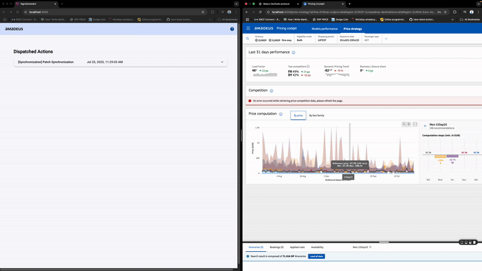

# NgRx DevTool - Architecture Visualization Tool

A powerful development tool for visualizing and debugging NgRx state management in Angular applications. Features **automatic effect detection** and **action correlation tracking**.

## Overview

This tool provides real-time monitoring and visualization of NgRx actions, state changes, and effects. It automatically detects which actions are dispatched by effects and correlates them back to their triggering user actions.



## Features

- **Real-time Action Monitoring** - Track all dispatched actions as they happen
- **Automatic Effect Detection** - Distinguishes user actions from effect-dispatched actions
- **Action Correlation** - Links effect results back to their triggering actions
- **State Visualization** - View current and previous states
- **Diff Viewer** - Compare state changes between actions
- **Visual Indicators** - Blue for user actions, orange for effect results

## Project Structure

- **ngrx-devtool** - Core library package
- **ngrx-devtool-ui** - Standalone visualization UI  
- **ngrx-devtool-demo** - Example implementation

---

## Quick Start

### Step 1: Clone and build

Since the package is not yet published to npm, use the development setup:

```bash
git clone <repository-url>
cd ngrx-devtool-proto
npm install
npm run build
```

### Step 2: Link the library to your project

```bash
cd dist/ngrx-devtool
npm link

# In your Angular project directory
npm link ngrx-devtool
```

> ⚠️ **Important:** If you encounter module resolution issues, see the [npm Link Issues](#npm-link-issues) section in Troubleshooting.

### Step 3: Add one line to your app

```typescript
// app.config.ts (standalone) or app.module.ts (NgModule)
import { loggerMetaReducer } from 'ngrx-devtool';

// Standalone API
export const appConfig: ApplicationConfig = {
  providers: [
    provideStore(
      { /* your reducers */ },
      { metaReducers: [loggerMetaReducer] }  // ← Add this
    ),
  ]
};

// Or NgModule
@NgModule({
  imports: [
    StoreModule.forRoot({ /* reducers */ }, { metaReducers: [loggerMetaReducer] }),
  ]
})
```

### Step 4: Run the DevTool server

```bash
# From the ngrx-devtool-proto directory
node dist/index.js
```

### Step 5: Open the DevTool UI

Open **http://localhost:3000** and start your Angular app. All actions will appear:
- 🔵 **Blue border** = User action
- 🟠 **Orange border** = Effect result (with "Triggered by" info)

---

## AI-Assisted Setup

**Prefer a hands-off approach?** Let an AI assistant set up the tool for you!

1. Copy this entire README
2. Open **GitHub Copilot Chat** in VS Code (Claude Sonnet 4 or Claude Opus 4.5 recommended)
3. Paste the README and prompt:

> "Set up ngrx-devtool in my Angular project following this README"

The AI will:
- Clone and build the library
- Link it to your project
- Add the meta-reducer to your store configuration
- Guide you through running the DevTool server

---

## How Effect Tracking Works

The DevTool detects effect-dispatched actions by **pattern matching on action names**:

| Pattern | Example | Detected As |
|---------|---------|-------------|
| `[* API *]` | `[Books API] Retrieved Book List` | Effect |
| `[* Service *]` | `[Auth Service] Login Success` | Effect |
| `*Success` | `loadBooksSuccess` | Effect |
| `*Failure` | `loadBooksFailure` | Effect |
| `*Error` | `fetchDataError` | Effect |
| `-> Succeeded` | `[Users] Fetch -> Succeeded` | Effect |
| Everything else | `[Books] Load Books` | User Action |

### Recommended Action Naming

```typescript
// User-initiated actions
export const BooksActions = createActionGroup({
  source: 'Books',  // No "API" suffix
  events: {
    'Load Books': emptyProps(),
    'Add Book': props<{ bookId: string }>(),
  },
});

// Effect-dispatched actions
export const BooksApiActions = createActionGroup({
  source: 'Books API',  // "API" suffix indicates effect result
  events: {
    'Retrieved Book List': props<{ books: Book[] }>(),
    'Load Failed': props<{ error: string }>(),
  },
});
```

---

## Advanced Configuration

### Custom WebSocket URL

```typescript
import { createDevToolMetaReducer } from 'ngrx-devtool';

provideStore(
  { /* reducers */ },
  { metaReducers: [createDevToolMetaReducer('ws://custom-host:4000')] }
)
```

### Conditional Enable (Production Safety)

```typescript
const metaReducers = !environment.production ? [loggerMetaReducer] : [];

provideStore({ /* reducers */ }, { metaReducers })
```

---

## Troubleshooting

### npm Link Issues

If you get module resolution errors after `npm link`, you need to enable symlink preservation.

> **Note:** This is required for **Amadeus Product Catalogue UI** and similar Nx/Angular monorepo projects.

**tsconfig.json:**
```json
{
  "compilerOptions": {
    "preserveSymlinks": true
  }
}
```

**angular.json** (in build options):
```json
{
  "architect": {
    "build": {
      "options": {
        "preserveSymlinks": true
      }
    }
  }
}
```

> **Note:** After running `npm install`, you may need to re-run `npm link ngrx-devtool`.

### Effects not being detected

Check that your effect action names include `API`, `Service`, `Success`, `Failure`, `Error`, `Complete`, or arrow notation like `-> Succeeded`. See the patterns table above.

### WebSocket connection issues

- Ensure the DevTool server is running (`node dist/index.js`) before starting your Angular app
- Check that ports 3000 and 4000 are not in use by other processes

---

## Contributing

1. Fork the repository
2. Make your changes
3. Test with the demo app: `ng serve ngrx-devtool-demo`
4. Submit a pull request


